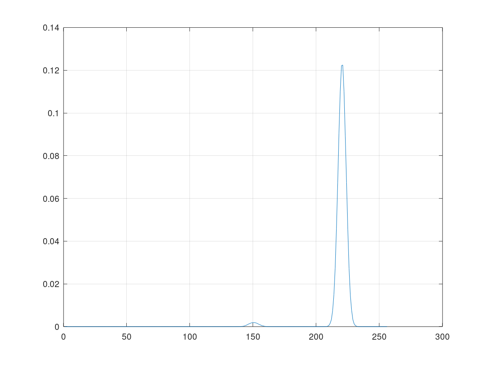
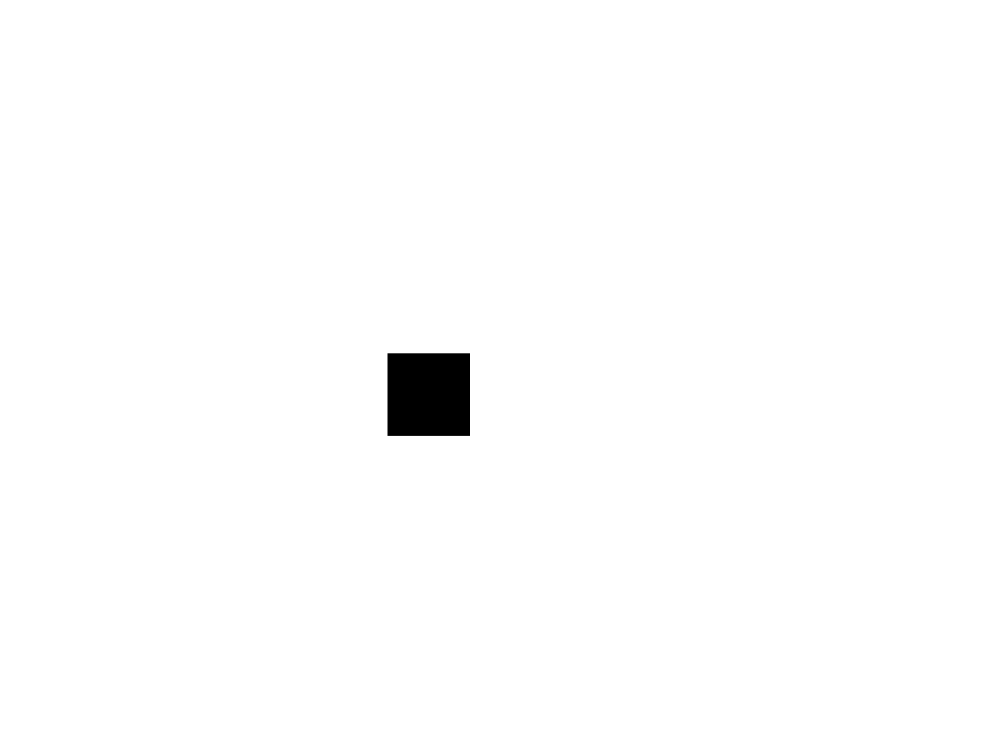

## 4.1.a.2 Grafique la función $J(T)$, y documente el valor $T=t$ que logra el valor mínimo de J(T), junto con las medias y varianzas de las dos funciones Gaussianas superpuestas. **¿Son coherentes tales valores con el histograma graficado en el punto anterior?**
>> R/ Los valores parecen coherentes respecto al histograma. El $T$ óptimo es de 167 y como se observa en la figura, es similar a la separacion observada en la figura 1. 

## 4.1.b Lograría el umbral óptimo $τ$ obtenido umbralizar satisfactoriamente la imagen de prueba? 
>> R/ Si, el umbral logra separar la imagen de prueba de manera satisfactoria como se ve en la imagen umbralizada en la figura 2. 

## 4.2 Calcule el umbral óptimo con el algoritmo de Kittler, y umbralice la imagen de trackedCell15.tif provista documentando los resultados. Muestre la imagen umbralizada. Que enfoque implementaría para mejorar el resultado de la umbralización?

>> La imagen umbralizada es la siguiente:

>> R/ Usando este mismo algoritmo, para mejorar el resultado de la umbralización lo que procedería es el preprocesamiento de la imagen. Generalmente lo que se usa es aumentar el contraste (para separar mejor de entrada los niveles de color) y definir mejor los bordes con algún algoritmo para reducir las transiciones borrosas entre los objetos y el fondo.

## 4.3 Explique matemáticamente cual es la diferencia entre el enfoque de máxima verosimilitud usado para el problema de ajuste de curvas (ecuación 7) y el implementado en el problema de clasificación de pixeles en el algoritmo de Kittler.

Para el problema del ajuste de curvas, se trata de encontrar una distribución de probabilidad óptima para cada una de las entradas N. Por lo tanto, se busca encontrar una distribuición gaussiana óptima para cada vector entrada y minimizar la función de error global para encontrar los pesos adecuados.
En el caso del algoritmo de Kittler, no se usan N distribuciones gaussianas sino sólo dos. Esas dos aproximan la probabilidad de que cada pixel pertenezca al fondo o al objeto. Se busca maximizar la verosimilitud de ambas funciones de densidad de manera que se encuentre un umbral óptimo de separación entre ambas subpoblaciones.

   

  
